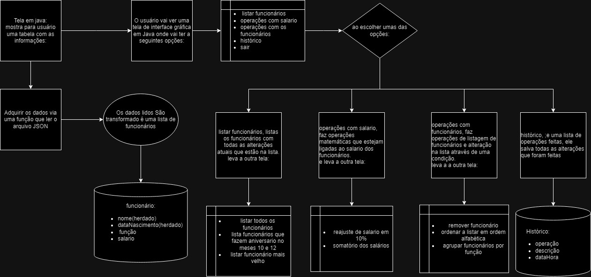

# Iniflexv.2
A aplicação se propõe a partir de uma base de dados disponibilzaado em uma tabela,
pegar esses dados e faz as seguintes tarefas:

– Inserir todos os funcionários, na mesma ordem e informações da tabela acima. 
– Remover o funcionário “João” da lista. 
– Imprimir todos os funcionários com todas suas informações, sendo que: 
• informação de data deve ser exibido no formato dd/mm/aaaa; 
• informação de valor numérico deve ser exibida no formatado com separador de milhar como ponto e decimal como vírgula. 
– Os funcionários receberam 10% de aumento de salário, atualizar a lista de funcionários com novo valor. 
– Agrupar os funcionários por função em um MAP, sendo a chave a “função” e o valor a “lista de funcionários”. 
– Imprimir os funcionários, agrupados por função. 
– Imprimir os funcionários que fazem aniversário no mês 10 e 12. 
– Imprimir o funcionário com a maior idade, exibir os atributos: nome e idade. 
– Imprimir a lista de funcionários por ordem alfabética. 
– Imprimir o total dos salários dos funcionários. 
– Imprimir quantos salários mínimos ganha cada funcionário, considerando que o salário mínimo é R$1212.00. 

A base de dados original é essa:
 

essa tabela foi convertida em um json com na pode ser vistos na classe, [tabela em json](src/main/resources/demo.json)
e a partir disso pode ser feitos as diversas operações.

Lingaguem: foi usado o java na sua versão 22.01

  

Ferramenta: Intellij na sua versão 2024

o Fluxograma a seguir explica como foi o planejamento: 
 
 

e nessa versão foi adicionado a opção de historico, para ver a operaçoes que foram feitas!